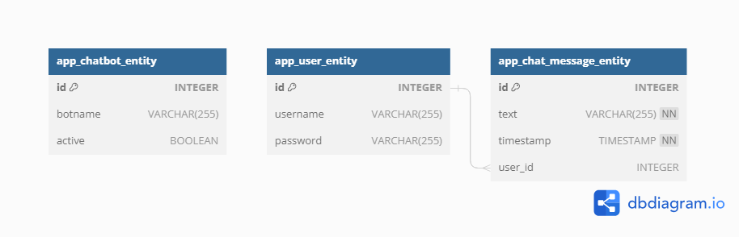

# FreeFeser
**Mitglieder:**
* Philipp Elvin Friedhoff
* Marvin Bendix Kühne
* Florian Reckow

## Inhaltsverzeichnis
- [Systemdokumentation](#systemdokumentation)
   - [Einleitung](#einleitung)
      - [Zweck der Dokumentation](#zweck-der-dokumentation)
      - [Kontext des Chatbot-Basissystems](#kontext-des-chatbot-basissystems)
   - [Kontextabgrenzung](#kontextabgrenzung)
      - [Fachlicher Kontext](#fachlicher-kontext)
      - [Technischer Kontext](#technischer-kontext)
      - [Visualisierung](#visualisierung)
      - [Zusammenfassung](#zusammenfassung)
   - [Lösungsstrategie](#lösungsstrategie)
      - [Technologieentscheidungen](#technologieentscheidungen)
      - [Architektur- und Entwurfsmuster](#architektur--und-entwurfsmuster)
      - [Qualitätsanforderungen](#qualitätsanforderungen)
      - [Organisatorische Entscheidungen](#organisatorische-entscheidungen)
      - [Motivation](#motivation)
   - [Bausteinsicht](#bausteinsicht)
   - [Laufzeitsichten](#laufzeitsichten)
   - [Infrastruktursicht](#infrastruktursicht)
   - [Querschnittliche Konzepte](#querschnittliche-konzepte)
   - [Schnittstellen](#schnittstellen)
      - [Spezifikation zur robusten Kommunikation](#spezifikation-zur-robusten-kommunikation)
         - [RESTful APIs](#restful-apis)
         - [Datenbank Connector](#datenbank-connector)
   - [Risiken und technische Schulden](#risiken-und-technische-schulden)
   - [Erweiterungen](#erweiterungen)
   - [Fehlerbehebung](#fehlerbehebung)
   - [Installationsanleitung](#installationsanleitung)
   - [Konfiguration](#konfiguration)
- [Bot-Dokumentation (Erweiterungen)](#bot-dokumentation-erweiterungen)
   - [TranslationBot](#translationbot)
   - [WeatherBot](#weatherbot)
   - [WikiBot](#wikibot)
- [weitere Schritte](#weitere-schritte)

## Systemdokumentation
Es folgt eine Beschreibung der internen Arbeitsweise der Software, einschließlich der Schnittstellen und APIs Beschreibung der Code-Architektur und -Struktur.

### Einleitung
Willkommen zur Systemdokumentation für das Chatbot-Basissystem, das im Rahmen unseres studentischen Projekts für das Modul "Softwaremodeling & Architecture" entwickelt wurde. Diese Dokumentation bietet einen umfassenden Einblick in die Architektur, Funktionsweise und technischen Entscheidungen hinter unserem Chatbot-Basissystem. Sie dient als wertvolle Ressource, um Entwicklern, Projektbeteiligten und anderen Interessenten ein tiefes Verständnis für das System zu vermitteln.

#### Zweck der Dokumentation
Das Hauptziel dieser Dokumentation besteht darin, die Architektur unseres Chatbot-Basissystems detailliert zu beschreiben. Wir zeigen, wie die verschiedenen Module und Komponenten des Systems zusammenwirken, um eine flexible und erweiterbare Umgebung für Chatbots bereitzustellen. Darüber hinaus werden wir die Schnittstellen zwischen den Modulen, die Datenbankanbindung und die Möglichkeiten der Integration von externen Systemen über Chatbots hinweg beleuchten.

#### Kontext des Chatbot-Basissystems
Unser Chatbot-Basissystem entstand aus der Begeisterung für Chatbots und der Vision, unser Produktportfolio um diese innovative Technologie zu erweitern. Als studentisches Team hatten wir die spannende Aufgabe, einen lauffähigen Prototypen für ein Chatbot-Basissystem zu entwickeln. Dieses System bildet die Grundlage für die Ausführung verschiedener Chatbots und soll eine nahtlose Integration neuer Chatbots ermöglichen.

Die Kernfunktionen unseres Chatbot-Basissystems umfassen die Unterstützung der Laufzeitumgebung für Chatbots, die einfache Integration neuer Chatbots und die reibungslose Kommunikation mit externen Systemen über die Chatbot-Schnittstellen.

### Kontextabgrenzung
Die Kontextabgrenzung definiert die Schnittstellen und Kommunikationspartner im Rahmen des Chatbotsystems. Dies umfasst sowohl die Interaktionen mit externen Systemen als auch die Benutzerschnittstellen.

#### Fachlicher Kontext
Der fachliche Kontext des Chatbotsystems umfasst die Interaktionen zwischen dem Nutzer, den externen APIs und der internen Datenbank.

**Externe Kommunikationspartner**  

Die externen Kommunikationspartner des Systems sind:

- REST-APIs (Deepl, Wikipedia, Openweather):
Das System interagiert mit verschiedenen externen APIs, um auf Benutzeranfragen zu reagieren. Es sendet Anfragen an die APIs und verarbeitet die empfangenen Antworten, um die gewünschten Informationen bereitzustellen.

- Datenbank:
Die Datenbank speichert den Chatverlauf und Nutzerinformationen. Das System verwendet Hibernate, um die Kommunikation zwischen der Anwendung und der Datenbank zu verwalten.

- Endnutzer: 
Die Schnittstelle zwischen dem System und dem Endnutzer ist das Terminal. Der Nutzer gibt Anfragen über das Terminal ein, und das System sendet die entsprechenden Anfragen an die APIs.

**Fachliche Schnittstellen**  

Die fachlichen Schnittstellen bestehen aus:

- Nutzereingabe: 
Die Nutzereingabe erfolgt über das Terminal. Der Nutzer gibt Anfragen in Textform ein.

- Systemausgabe:
Das System gibt Antworten und Informationen in Textform über das Terminal aus.

- HTTP-Anfragen und -Antworten:
Das System sendet HTTP-Anfragen an die externen APIs und empfängt HTTP-Antworten, die verarbeitet werden, um die gewünschten Informationen zu extrahieren.

- Datenbankzugriff:
Das System verwendet Hibernate, um auf die H2-Datenbank zuzugreifen. Es speichert Chatnachrichten und Nutzerdaten in der Datenbank.

#### Technischer Kontext
Der technische Kontext des Systems beschreibt die technischen Schnittstellen und Kanäle zwischen den Komponenten.

**Technische Schnittstellen**  

Die technischen Schnittstellen umfassen:

- Terminal:
Das Terminal dient als Schnittstelle zwischen dem Endnutzer und dem System. Es ermöglicht die Eingabe von Anfragen und die Anzeige von Antworten.

- HTTP-Verbindungen:
Das System verwendet HTTP, um Anfragen an die externen APIs zu senden und Antworten zu empfangen. Dies erfolgt über die entsprechenden Endpunkte der APIs.

- Datenbankverbindung:
Das System nutzt Hibernate, um auf die eingebettete H2-Datenbank zuzugreifen. Dies ermöglicht das Speichern und Abrufen von Chatverläufen und Nutzerinformationen.

#### Visualisierung
Das zugehörige Kontextdiagramm:


#### Zusammenfassung
Die Kontextabgrenzung des Chatbotsystems zeigt die wesentlichen Schnittstellen und Kommunikationspartner auf fachlicher und technischer Ebene. Sie legt die Grundlage für das Verständnis der Interaktionen und bildet die Grundlage für die weiterführende Entwicklung und Integration.

### Lösungsstrategie
Die Lösungsstrategie umfasst eine Übersicht über die grundlegenden Entscheidungen und Lösungsansätze, die den Entwurf und die Implementierung des Systems prägen. Dieser Abschnitt beleuchtet wichtige Aspekte, die maßgeblich zur Ausgestaltung der Architektur beitragen, darunter Technologieentscheidungen, Architekturmuster, Qualitätsanforderungen und organisatorische Überlegungen.

#### Technologieentscheidungen
Für die Umsetzung unseres Systems wurden sorgfältig Technologieentscheidungen getroffen, die eine stabile und skalierbare Grundlage schaffen. Dabei haben wir uns für Technologien entschieden, die unsere Anforderungen an Performance, Erweiterbarkeit und Benutzerfreundlichkeit erfüllen. Dies umfasst die Auswahl der Programmiersprachen, Frameworks und Datenbanktechnologien, die im Einklang mit unseren Zielen stehen. (Siehe [Bausteinsicht](#bausteinsicht) für detaillierte Informationen zur Systemstruktur und Technologieentscheidungen.)

#### Architektur- und Entwurfsmuster
Die Top-Level-Zerlegung unseres Systems basiert auf bewährten Architektur- und Entwurfsmustern. Diese Muster dienen als Leitfaden für die Organisation und Strukturierung unseres Systems, um eine klare Trennung von Verantwortlichkeiten und eine bessere Wartbarkeit zu gewährleisten. (Siehe [Bausteinsicht](#bausteinsicht) für eine tiefgreifende Analyse der Architektur und Entwurfsmuster.)

#### Qualitätsanforderungen
Unsere Lösungsstrategie zielt darauf ab, die wichtigsten Qualitätsanforderungen zu erfüllen. Hierbei legen wir besonderen Fokus auf Aspekte wie Performance, Sicherheit und Benutzererlebnis. Die gewählten Technologien und Entwurfsmuster sind darauf ausgerichtet, diese Qualitätsziele zu erreichen und gleichzeitig die Flexibilität für zukünftige Anpassungen zu gewährleisten. (Siehe [Laufzeitsichten](#laufzeitsichten) für Einblicke in die Performance-Analyse und [Querschnittliche Konzepte](#querschnittliche-konzepte) für Sicherheitsüberlegungen.)

#### Organisatorische Entscheidungen
Neben technischen Entscheidungen berücksichtigt unsere Lösungsstrategie auch organisatorische Aspekte. Hierzu gehören beispielsweise bestimmte Entwicklungsprozesse und die Delegation von Aufgaben an relevante Stakeholder. Diese Entscheidungen tragen dazu bei, eine effiziente Zusammenarbeit und einen reibungslosen Entwicklungsverlauf sicherzustellen. (Siehe [Bausteinsicht](#bausteinsicht) für organisatorische Überlegungen.)

##### Motivation
Die getroffenen Entscheidungen dienen als Grundlage für den Entwurf und die Implementierung unseres Systems. Sie ermöglichen es, die Anforderungen der Aufgabenstellung effektiv zu erfüllen und gleichzeitig eine robuste und erweiterbare Architektur zu schaffen. Die folgenden Abschnitte vertiefen die einzelnen Entscheidungen und beleuchten ihre Auswirkungen auf die Gesamtarchitektur.

### Bausteinsicht
Statische Zerlegung des Systems. Die Abstraktion des Sourcecodes, dargestellt als Hierarchie von “White-Boxes” (die wiederum kleinere Black-Boxes beinhalten), bis zu einem angemessenen Detaillierungsgrad

Motivation
Behalten Sie den Überblick über den Quellcode, indem Sie die statische Struktur des Systems durch Abstraktion verständlich machen. Damit ermöglichen Sie Kommunikation auf abstrakterer Ebene, ohne zu viele Implemenierungsdetails offenlegen zu müssen.

Form
Die Bausteinsicht ist eine hierarchische Sammlung von Blackboxen und Whiteboxen und deren Beschreibungen.

### Laufzeitsichten


Das Verhalten der Bausteine in Form von dynamischen Szenarien, die die wichtigsten Prozesse oder Features abdecken, Interaktionen an kritischen externen Schnittstellen oder “interessante” interne Abläufe und kritische Ausnahme- oder Fehlerfälle.

Motivation
Sie sollten verstehen, wie (Instanzen von) Bausteine(n) Ihres Systems ihre jeweiligen Aufgaben erfüllen und zur Laufzeit miteinander kommunizieren. Nutzen Sie diese Szenarien in der Dokumentation hauptsächlich für eine verständlichere Kommunikation mit denjenigen Stakeholdern, die die statischen Modelle (z.B. Bausteinsicht, Verteilungssicht) weniger verständlich finden.

Form
Für die Beschreibung von Szenarien gibt es zahlreiche Ausdrucksmöglichkeiten. Nutzen Sie beispielsweise:

Nummerierte Schrittfolgen oder Aufzählungen in Umgangssprache
Aktivitäts- oder Flussdiagramme
Sequenzdiagramme
BPMN (Geschäftsprozessmodell und -notation) oder EPKs (Ereignis-Prozessketten)
Zustandsautomaten
…

### Infrastruktursicht
Technische Infrastruktur mit Prozessoren, Systemtopologie, und die Abbildung der Software-Bausteine auf diese Infrastruktur.

Motivation
Software läuft nicht ohne Infrastruktur. Diese zugrundeliegende Infrastruktur beeinflusst Ihr System und/oder querschnittliche Lösungskonzepte, daher müssen Sie diese Infrastruktur kennen.

Form
Das oberste Verteilungsdiagramm könnte bereits in Ihrem technischen Kontext enthalten sein, mit Ihrer Infrastruktur als EINE Blackbox. Jetzt zoomen Sie in diese Infrastruktur mit weiteren Verteilungsdiagrammen hinein:

Die UML stellt mit Verteilungsdiagrammen (Deployment diagrams) eine Diagrammart zur Verfügung, um diese Sicht auszudrücken. Nutzen Sie diese, evtl. auch geschachtelt, wenn Ihre Verteilungsstruktur es verlangt.
Falls Ihre Infrastruktur-Stakeholder andere Diagrammarten bevorzugen, die beispielsweise Prozessoren und Kanäle zeigen, sind diese hier ebenfalls einsetzbar.



### Querschnittliche Konzepte
Übergreifende, generelle Prinzipien und Lösungsansätze, die in vielen Teilen der Architektur einheitlich benutzt werden. Konzepte beziehen sich oft auf mehrere Bausteine. Hier findet man Themen wie Domänenmodelle, Architekturmuster und -stile, Regeln zur Nutzung bestimmter Technologiestacks, etc.

Motivation
Konzepte bilden die Grundlage für konzeptionelle Integrität (Konsistenz, Homogenität) der Architektur und damit eine wesentliche Grundlage für die innere Qualität Ihrer Systeme. Manche dieser Themen lassen sich nur schwer als Baustein in der Architektur unterbringen (z.B. das Thema „Sicherheit“).

Form
Kann vielfältig sein:
Konzeptpapiere mit beliebiger Gliederung,
übergreifende Modelle/Szenarien mit Notationen, die Sie auch in den Architektursichten nutzen,
beispielhafte Implementierung speziell für technische Konzepte,
Verweise auf „übliche“ Nutzung von Standard-Frameworks (beispielsweise die Nutzung von Hibernate als Object/Relational Mapper).

### Schnittstellen
| Schnittstelle       | Zweck und Funktion                                   | Operationen | Kommunikationsprotokoll | Datenformat      | Authentifizierung                                 |
|---------------------|------------------------------------------------------|-------------|-------------------------|------------------|---------------------------------------------------|
| DeepL API           | Übersetzungsdienst für Texte                         | GET         | HTTP                    | JSON             | API-Key (aus Credential-Ordner)                   |
| Wikipedia API       | Abruf von Informationen aus Wikipedia                | GET         | HTTP                    | JSON             | Keine                                             |
| OpenWeather API     | Wetterdatenabruf für bestimmte Standorte             | GET         | HTTP                    | JSON             | API-Key (aus Credential-Ordner)                   |
| Datenbank Connector | Kommunikation mit der Datenbank über Hibernate (HQL) | Lesen       | SQL (HQL)               | Tabellen/Objekte | Username und Passwort (in Hibernate-Configuration |

#### Spezifikation zur robusten Kommunikation
Um sicherzustellen, dass die Kommunikation mit externen Systemen zuverlässig und fehlerfrei erfolgt, wurden spezifische Maßnahmen und Strategien entwickelt. Diese dienen dazu, potenzielle Herausforderungen in der Kommunikation zu bewältigen und die Gesamtleistung des Chatbot-Systems zu verbessern. Im Folgenden werden die spezifischen Ansätze für jede der Schnittstellen sowie der Datenbank Connector beschrieben.

Die Anforderungen an Fehlerbehandlung, Timeouts, Retry-Strategien und Skalierbarkeit wurden formuliert, um eine reibungslose Interaktion des Systems mit den Schnittstellen zu gewährleisten. Diese Spezifikationen stellen sicher, dass unerwartete Ereignisse und Ausfälle angemessen gehandhabt werden können. Beachten Sie, dass diese Spezifikationen auf der aktuellen Entwicklungsphase basieren und im Laufe der Zeit weiterentwickelt werden können, um den Anforderungen des Systems gerecht zu werden.

##### RESTful APIs
- **Fehlerbehandlung:**  
  Bei unerwarteten API-Antworten oder Verbindungsfehlern werden Fehlercodes verarbeitet.
- **Timeouts:**  
  Standardmäßig 10 Sekunden für API-Anfragen.
- **Retry-Strategien:**  
  Bei Zeitüberschreitung wird die Anfrage bis zu 2 Mal erneut versucht.
- **Skalierbarkeit:**  
  API-Anbindungen sind austauschbar und können entsprechend den Anforderungen gewechselt werden.

##### Datenbank Connector
- **Fehlerbehandlung:** 
  SQL-Abfragefehler werden erfasst und als lesbare Meldungen behandelt.
- **Timeouts:**  
  Maximal 5 Sekunden für Datenbankanfragen.
- **Retry-Strategien:**  
  Bei Verbindungsfehlern wird die Anfrage bis zu 3 Mal erneut versucht.
- **Skalierbarkeit:** 
  Die Datenbank kann in der Konfiguration leicht ausgetauscht werden, da Hibernate als ORM verwendet wird.

### Risiken und technische Schulden
Bekannte Risiken und angehäufte technische Schulden. Welche potentiellen Probleme lauern im und um das System? Über welche Schwächen beklagen sich die Entwicklungsteams?

Erläutern Sie hier die Verletzung bekannter Prinzipien und weiteres Themen aus der Vorlesung.

### Erweiterungen
Anweisungen zum Erstellen von Erweiterungen oder zur Anpassung der Software
Als Erweiterung ist hier ein neuer Chatbot zu sehen.

### Fehlerbehebung
1. **Bot gibt nicht die richtige Response**   
   Es kann sein, dass ein Bot Ihnen eventuell nicht die richtige Antwort ausgibt. Prüfen Sie in dem Fall die Rechtschreibung und achten Sie darauf Satzanfänge und Nomen groß zu schreiben.

### Installationsanleitung
Folgen Sie diesen Schritten, um unsere Software auf Ihrem System zu installieren und auszuführen.

1. **Repository klonen**  
   Öffnen Sie Ihr Terminal und führen Sie den folgenden Befehl aus, um das GitHub-Repository zu klonen:

    ```
    git clone https://github.com/FHDW-23SS-SMA-IFWS421B/FreeFeser.git
    ```

2. **Maven-Abhängigkeiten installieren**  
   a. Navigieren Sie in das geklonte Verzeichnis:
    ```
    cd FreeFeser
    ```  
   b. Führen Sie den folgenden Befehl aus, um die Maven-Abhängigkeiten zu installieren:  
    ```
    mvn install
    ``` 

3. **Java-JAR ausführen**  
   a. Navigieren Sie zum `target`-Verzeichnis:  
    ```
    cd target
    ```

   b. Führen Sie die Java-JAR-Datei aus:  
    ```
    java -jar freefeser-app-1.0-SNAPSHOT.jar
    ```
   
4. **Verwendung einer IDE**  
   a. Öffnen Sie Ihre bevorzugte Java-IDE.  
   b. Importieren Sie das geklonte Verzeichnis als Projekt.  
   c. Finden Sie die `FreeFeserApp`-Klasse und führen Sie sie in der IDE aus.

Bitte beachten Sie, dass eine detaillierte [Java/Maven-Installationsanleitung](documentation/JAVA.md) im Repository vorhanden ist. Diese enthält spezifische Anweisungen für die Java- sowie Maven-Installation.

**Hinweis:** Stellen Sie sicher, dass Sie eine gültige Java-Version auf Ihrem System haben, um die Software erfolgreich auszuführen.

### Konfiguration
### Chatbotprogramm

Das Chatbotprogramm bietet neben der Interaktion mit den Bots verschiedene Konfigurationsmöglichkeiten, die sowohl die Personalisierung für den Nutzer als auch die Bedienung der Software erleichtern.

#### Nutzerverwaltung

Vor dem Start des Programms wird der Nutzer aufgefordert, sich entweder mit einem bestehenden Nutzeraccount einzuloggen oder einen neuen Nutzer anzulegen.

##### 1. Bestehender Nutzer

Der Nutzer wählt die Option aus, dass er bereits über einen Account verfügt. Anschließend gibt er seinen Nutzernamen sowie sein Passwort ein. Sind die eingegebenen Daten korrekt, wird der Nutzer erfolgreich eingeloggt und erhält Zugriff auf die Chatbots. Falls das eingegebene Passwort nicht korrekt ist, wird der Nutzer aufgefordert, das Passwort erneut einzugeben, bis die korrekten Daten eingegeben wurden.

##### 2. Neuer Nutzer

Wählt der Nutzer die Option, dass er noch keinen Account besitzt, wird er dazu aufgefordert, einen neuen Nutzernamen zu vergeben. Sollte dieser Nutzername bereits vergeben sein, wird der Nutzer gebeten, einen anderen Nutzernamen einzugeben. Anschließend wird der Nutzer aufgefordert, ein Passwort für seinen neuen Account festzulegen. Nach erfolgreicher Passwortvergabe erfolgt automatisch der Login mit dem neu erstellten Benutzeraccount.

#### Bots Auflisten

Um dem Nutzer eine Übersicht über die verfügbaren Bots zu verschaffen, kann er den Befehl `list Bots` ausführen. Dadurch erhält der Nutzer eine klare Übersicht über die drei verfügbaren Bots, die er anschließend auswählen und nutzen kann.

#### Aktivieren und Deaktivieren von Bots

Im Konfigurationsbereich des Chatbotprogramms hat der Nutzer die Möglichkeit, die einzelnen Bots nach Bedarf zu aktivieren oder zu deaktivieren.

##### Bot Aktivieren

Der Nutzer kann jeden einzelnen Bot aktivieren, indem er den entsprechenden Befehl ausführt. Nach der Aktivierung ist der Bot sofort einsatzbereit und kann durch die Erwähnung mit `@botname` angesprochen werden.

##### Bot Deaktivieren

Falls der Nutzer einen Bot vorübergehend nicht verwenden möchte, kann er diesen deaktivieren. Ein deaktivierter Bot kann nicht mehr durch einfaches Ansprechen mit `@botname` aktiviert werden. Stattdessen muss der Nutzer den Bot manuell wieder aktivieren.

###### Durchführung

- Um einen deaktivierten Bot zu aktivieren, kann der Nutzer den Befehl `@activate botname` ausführen. Dadurch wird der ausgewählte Bot sofort aktiviert und einsatzbereit.
- Um einen aktiven Bot zu deaktivieren, kann der Nutzer den Befehl `@deactivate botname` verwenden. Durch diese Aktion wird der Bot vorübergehend deaktiviert und kann nicht mehr durch Erwähnung aktiviert werden.

##### Vorteile

Die Möglichkeit, Bots nach Bedarf zu aktivieren oder zu deaktivieren, bietet dem Nutzer eine erhöhte Flexibilität und Kontrolle über die Nutzung des Chatbotprogramms. Dies ermöglicht es dem Nutzer, die verfügbaren Ressourcen effizient zu verwalten und die Bots entsprechend den individuellen Anforderungen zu nutzen.

#### Zusammenfassung

Die Aktivierungs- und Deaktivierungsfunktion für Bots erlaubt dem Nutzer eine individuelle Anpassung der verfügbaren Bots. Ein deaktivierter Bot kann nicht durch einfache Erwähnung angesprochen werden, sondern muss vom Nutzer aktiviert werden. Diese Funktion fördert eine maßgeschneiderte und effiziente Nutzung der Chatbotsoftware.


## Bot-Dokumentation (Erweiterungen)
Je Bot soll eine eigene, kleine Dokumentation über den Aufbau/Struktur des Bot-Systems dargestellt werden.

Jede Bot-Dokumentation folgt dabei einer kleinen Systemdokumentation mit folgenden Punkten:

Kontextabgrenzung
Lösungsstrategie
Bausteinsicht
Laufzeitsicht
Schnittstellen
Je nach Ansatz sind noch weitere Punkte wichtig.

### TranslationBot
#### Zweck und Funktionalität

Der Übersetzerbot wurde entwickelt, um Nutzern die Möglichkeit zu bieten, Wörter und Texte in verschiedene Sprachen zu übersetzen. Mithilfe der DeepL-API kann der Bot Benutzereingaben analysieren und diese in die gewünschte Zielsprache übersetzen. Der Bot wird durch die Erwähnung `@translationbot` zusammen mit dem zu übersetzenden Text und der gewünschten Zielsprache aktiviert.

#### Funktionsweise

Der Übersetzerbot nutzt leistungsstarke natürliche Sprachverarbeitungstechniken, um den eingegebenen Text und die gewünschte Zielsprache zu extrahieren. Der Bot ist darauf ausgelegt, eine Vielzahl von Nutzeranfragen zu verstehen, ohne an feste Muster gebunden zu sein. Diese Flexibilität wird durch die Implementierung einer speziellen Bibliothek zur Verbesserung der Sprachverständlichkeit ermöglicht.

#### Schlüsselmerkmale

- **Vielsprachige Unterstützung**: Der Übersetzerbot kann Texte in eine breite Palette von Zielsprachen übersetzen.
- **Variation der Anfragen**: Nutzer können verschiedene Formulierungen verwenden, um Texte zur Übersetzung anzugeben, ohne an eine feste Syntax gebunden zu sein.
- **Natürliche Sprachverarbeitung**: Durch den Einsatz von NLP-Techniken kann der Bot die Absichten der Benutzer besser erfassen und angemessen reagieren.
- **Spezielle Bibliothek**: Die Implementierung einer speziellen Bibliothek zur Verbesserung der Sprachverständlichkeit ermöglicht es dem Bot, eine Vielzahl von Nutzeranfragen zu verarbeiten.

#### Beispielanfragen

- `@translationbot Übersetze 'Hallo' ins Spanische.`
- `@translationbot Kannst du diesen Satz ins Französische übersetzen? 'Ich liebe das Reisen.'`
- `@translationbot Bitte übersetze diesen Absatz ins Deutsche: 'The world is full of beauty.'`

#### Antwortformat

Der Übersetzerbot antwortet normalerweise mit dem übersetzten Text in der angeforderten Zielsprache.

### WeatherBot
#### Zweck und Funktionalität

Der Wetterbot wurde entwickelt, um Nutzern Informationen über das aktuelle Wetter an einem beliebigen Ort auf der Welt bereitzustellen. Er wird durch die Erwähnung `@weatherbot` zusammen mit dem gewünschten Ort aktiviert. Der Bot ist darauf ausgelegt, eine breite Palette von Nutzeranfragen zu verstehen, ohne auf feste Muster angewiesen zu sein. Dies wird durch die Implementierung einer speziellen Bibliothek zur Verbesserung der Sprachverständlichkeit ermöglicht.

#### Funktionsweise

Der Wetterbot verwendet fortschrittliche natürliche Sprachverarbeitungstechniken, um die Benutzereingabe zu analysieren und den gewünschten Ort zu extrahieren. Dabei kann der Bot verschiedene Formulierungen und Varianten von Anfragen verstehen, z. B. "Wie ist das Wetter in Berlin?" oder "Sag mir das aktuelle Wetter in Berlin". Die Verwendung der speziellen Bibliothek zur Sprachverständlichkeit ermöglicht es dem Bot, flexibel auf eine Vielzahl von Nutzerprompts zu reagieren.

#### Schlüsselmerkmale

- **Ortsunabhängigkeit**: Der Wetterbot kann für jeden Ort auf der Welt verwendet werden, solange der Ort in der Benutzereingabe angegeben wird.
- **Variation der Anfragen**: Nutzer können verschiedene Formulierungen verwenden, um das Wetter abzurufen, ohne an eine feste Syntax gebunden zu sein.
- **Natürliche Sprachverarbeitung**: Durch den Einsatz von NLP-Techniken kann der Bot die Absichten der Benutzer besser verstehen und angemessen darauf reagieren.
- **Spezielle Bibliothek**: Die Implementierung einer speziellen Bibliothek zur Verbesserung der Sprachverständlichkeit ermöglicht es dem Bot, mehr Vielfalt in den Nutzeranfragen zu erfassen.

#### Beispielanfragen

- `@weatherbot Wie ist das Wetter in New York?`
- `@weatherbot Gibt es Regen in London?`
- `@weatherbot Zeig mir die aktuelle Wetterlage in Paris.`

#### Antwortformat

Der Wetterbot antwortet in der Regel mit Informationen zum aktuellen Wetter am angegebenen Ort. Dies könnte Informationen wie Temperatur, Luftfeuchtigkeit, Windgeschwindigkeit, Wetterbedingungen (z. B. sonnig, bewölkt, regnerisch) und gegebenenfalls Vorhersagen für die kommenden Stunden oder Tage umfassen.

### WikiBot
#### Zweck und Funktionalität

Der Wikibot wurde entwickelt, um Nutzern Kerninformationen zu einer Vielzahl von Themen bereitzustellen, basierend auf ihren Anfragen. Durch die Nutzung der Wikipedia-API kann der Bot den Benutzern kurz und prägnant die wichtigsten Informationen zu dem gewünschten Thema vermitteln. Der Bot wird aktiviert, indem der Nutzer `@wikibot` gefolgt vom gewünschten Thema anspricht.

#### Funktionsweise

Der Wikibot verwendet fortschrittliche natürliche Sprachverarbeitungstechniken, um die Eingabe des Benutzers zu analysieren und das gewünschte Thema zu extrahieren. Der Bot ist darauf ausgelegt, verschiedene Formulierungen und Varianten von Anfragen zu verstehen, ohne an feste Muster gebunden zu sein. Diese Flexibilität wird durch die Implementierung einer speziellen Bibliothek zur Verbesserung der Sprachverständlichkeit ermöglicht.

#### Schlüsselmerkmale

- **Breites Themenspektrum**: Der Wikibot kann Informationen zu einer breiten Palette von Themen liefern, die in der Wikipedia abgedeckt werden.
- **Variation der Anfragen**: Nutzer können unterschiedliche Satzstrukturen und Formulierungen verwenden, um Informationen abzurufen, ohne an eine bestimmte Syntax gebunden zu sein.
- **Natürliche Sprachverarbeitung**: Durch den Einsatz von NLP-Techniken kann der Bot die Absichten der Benutzer besser erfassen und angemessen reagieren.
- **Spezielle Bibliothek**: Die Implementierung einer speziellen Bibliothek zur Verbesserung der Sprachverständlichkeit ermöglicht es dem Bot, eine breite Vielfalt von Nutzeranfragen zu verstehen.

#### Beispielanfragen

- `@wikibot Erzähle mir etwas über Albert Einstein.`
- `@wikibot Was kannst du mir über erneuerbare Energien sagen?`
- `@wikibot Ich möchte Informationen über die französische Revolution.`

#### Antwortformat

Der Wikibot gibt in der Regel eine kurze und prägnante Zusammenfassung der wichtigsten Informationen zum angegebenen Thema aus Wikipedia aus. Dies könnte biografische Details, historische Ereignisse, wissenschaftliche Konzepte oder andere relevante Informationen umfassen.


## weitere Schritte
1. Fehlerbehandlung verbessern
2. Unit-/Integration-Tests schreiben
