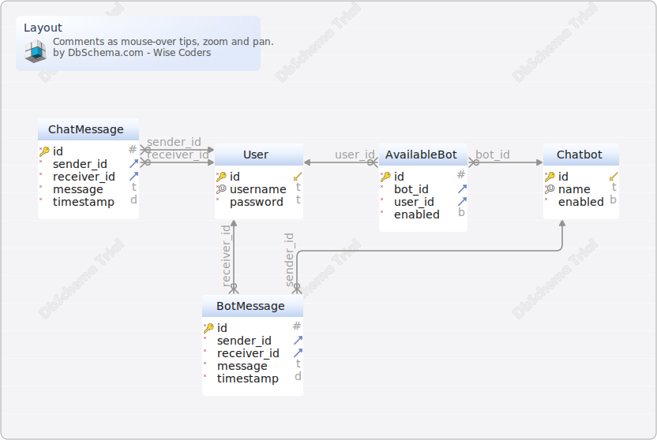

# FreeFeser

#Layout
Generated using [DbSchema](https://dbschema.com)

### Layout

## Tables

1. [public.AvailableBot](#table-public.availablebot) 2. [public.BotMessage](#table-public.botmessage)
   3. [public.Chatbot](#table-public.chatbot) 4. [public.ChatMessage](#table-public.chatmessage)
   5. [public.User](#table-public.user)

### Table public.AvailableBot

|             |          |         |
|-------------|----------|---------|
| * &#128273; | id       | serial  |
| * &#11016;  | bot\_id  | integer |
| * &#11016;  | user\_id | integer |
| *           | enabled  | boolean |

##### Indexes

|           |                  |       |
|-----------|------------------|-------|
| &#128273; | pk\_availablebot | ON id |

##### Foreign Keys

|  |    |                                                 |
|--|----|-------------------------------------------------|
|  | fk | ( bot\_id ) ref [public.Chatbot](#Chatbot) (id) |
|  | fk | ( user\_id ) ref [public.User](#User) (id)      |

### Table public.BotMessage

|             |              |           |
|-------------|--------------|-----------|
| * &#128273; | id           | serial    |
| * &#11016;  | sender\_id   | integer   |
| * &#11016;  | receiver\_id | integer   |
| *           | message      | text      |
| *           | timestamp    | timestamp |

##### Indexes

|           |                |       |
|-----------|----------------|-------|
| &#128273; | pk\_botmessage | ON id |

##### Foreign Keys

|  |    |                                                    |
|--|----|----------------------------------------------------|
|  | fk | ( sender\_id ) ref [public.Chatbot](#Chatbot) (id) |
|  | fk | ( receiver\_id ) ref [public.User](#User) (id)     |

### Table public.ChatMessage

|             |              |           |
|-------------|--------------|-----------|
| * &#128273; | id           | serial    |
| * &#11016;  | sender\_id   | integer   |
| * &#11016;  | receiver\_id | integer   |
| *           | message      | text      |
| *           | timestamp    | timestamp |

##### Indexes

|           |                 |       |
|-----------|-----------------|-------|
| &#128273; | pk\_chatmessage | ON id |

##### Foreign Keys

|  |    |                                                |
|--|----|------------------------------------------------|
|  | fk | ( sender\_id ) ref [public.User](#User) (id)   |
|  | fk | ( receiver\_id ) ref [public.User](#User) (id) |

### Table public.Chatbot

|                       |         |             |
|-----------------------|---------|-------------|
| * &#128273;  &#11019; | id      | serial      |
| * &#128269;           | name    | varchar(50) |
| *                     | enabled | boolean     |

##### Indexes

|           |                    |         |
|-----------|--------------------|---------|
| &#128273; | pk\_chatbot        | ON id   |
| &#128269; | unq\_chatbot\_name | ON name |

### Table public.User

|                       |          |              |
|-----------------------|----------|--------------|
| * &#128273;  &#11019; | id       | serial       |
| * &#128269;           | username | varchar(50)  |
| *                     | password | varchar(255) |

##### Indexes

|           |                     |             |
|-----------|---------------------|-------------|
| &#128273; | pk\_user            | ON id       |
| &#128269; | unq\_user\_username | ON username |
