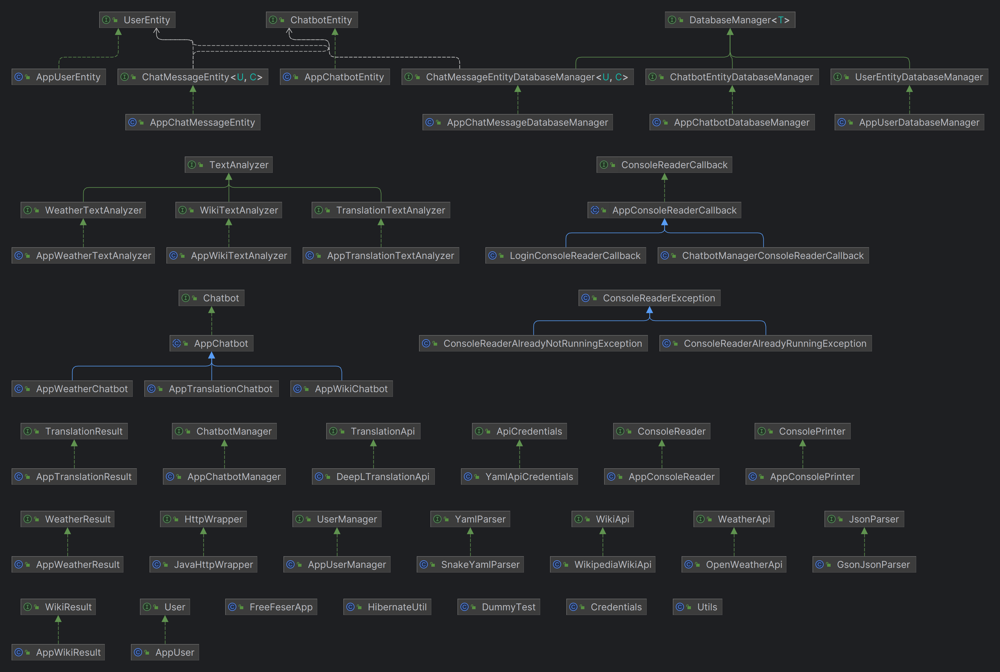
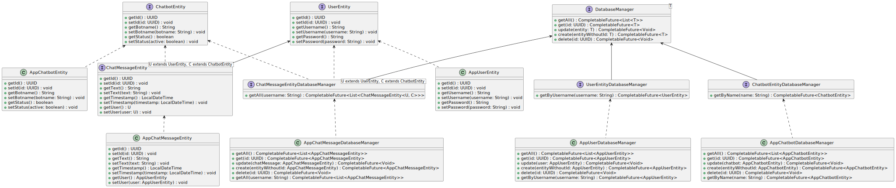
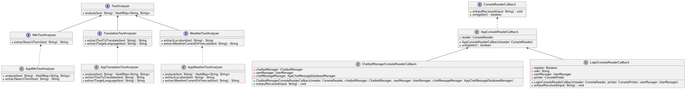
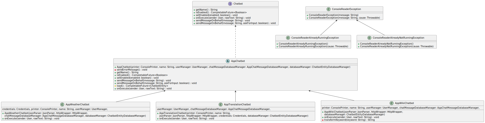
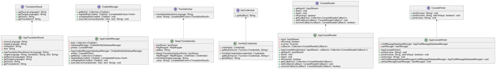
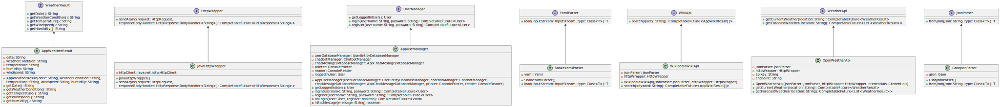
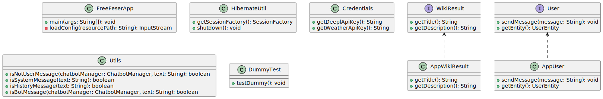
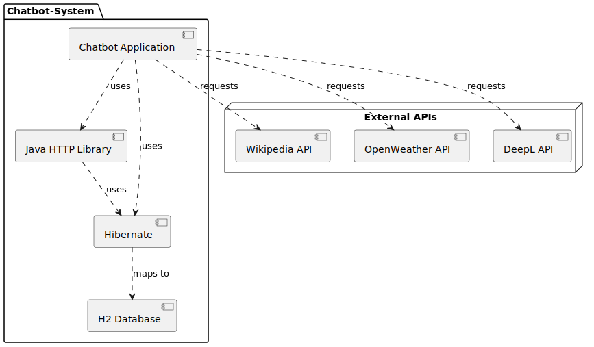

# FreeFeser
**Mitglieder:**
* Philipp Elvin Friedhoff
* Marvin Bendix Kühne
* Florian Reckow

## Inhaltsverzeichnis
- [Systemdokumentation](#systemdokumentation)
    - [Einleitung](#einleitung)
        - [Zweck der Dokumentation](#zweck-der-dokumentation)
        - [Kontext des Chatbot-Basissystems](#kontext-des-chatbot-basissystems)
    - [Kontextabgrenzung](#kontextabgrenzung)
        - [Fachlicher Kontext](#fachlicher-kontext)
        - [Technischer Kontext](#technischer-kontext)
        - [Visualisierung](#visualisierung)
        - [Zusammenfassung](#zusammenfassung)
    - [Lösungsstrategie](#lösungsstrategie)
        - [Technologieentscheidungen](#technologieentscheidungen)
        - [Architektur- und Entwurfsmuster](#architektur--und-entwurfsmuster)
        - [Qualitätsanforderungen](#qualitätsanforderungen)
        - [Organisatorische Entscheidungen](#organisatorische-entscheidungen)
        - [Zusammenfassung](#zusammenfassung-1)
    - [Bausteinsicht](#bausteinsicht)
        - [UML-Diagramm](#uml-diagramm)
    - [Laufzeitsichten](#laufzeitsichten)
        - [Einleitung](#einleitung-1)
        - [Benutzerauthentifizierung](#benutzerauthentifizierung)
            - [Anwendungsstart](#anwendungsstart)
        - [Hauptmenü](#hauptmenü)
            - [Eingabeaufforderung](#eingabeaufforderung)
        - [Zusatzinformationen](#zusatzinformationen)
        - [Kritische Schnittstellen](#kritische-schnittstellen)
    - [Infrastruktursicht](#infrastruktursicht)
        - [Technologie-Stack](#technologie-stack)
        - [Externe APIs](#externe-apis)
        - [Deploymentdiagramm](#deployment-diagramm)
        - [Datenbankschema](#datenbankschema)
            - [App-Chatbot-Entity](#appchatbotentity)
            - [App-User-Entity](#appuserentity)
            - [App-Chatmessage-Entity](#appchatmessageentity)
        - [Beziehungen](#beziehungen)
        - [Zusammenfassung](#zusammenfassung-2)
    - [Querschnittliche Konzepte](#querschnittliche-konzepte)
    - [Schnittstellen](#schnittstellen)
        - [Spezifikation zur robusten Kommunikation](#spezifikation-zur-robusten-kommunikation)
            - [RESTful APIs](#restful-apis)
            - [Datenbank Connector](#datenbank-connector)
    - [Risiken und technische Schulden](#risiken-und-technische-schulden)
    - [Erweiterungen](#erweiterungen)
    - [Fehlerbehebung](#fehlerbehebung)
        - [Aktivieren der Logs](#aktivieren-der-logs)
    - [Installationsanleitung](#installationsanleitung)
    - [Konfiguration](#konfiguration)
        - [Nutzerverwaltung](#nutzerverwaltung)
        - [Bots Auflisten](#bots-auflisten)
        - [Aktivieren und Deaktivieren von Bots](#aktivieren-und-deaktivieren-von-bots)
            - [Durchführung](#durchführung)
        - [Software beenden](#software-beenden)
        - [Hilfestellung für Nutzer](#hilfestellung-für-nutzer)
        - [Zusammenfassung](#zusammenfassung-3)
- [Bot-Dokumentation (Erweiterungen)](#bot-dokumentation-erweiterungen)
    - [TranslationBot](#translationbot)
        - [Zweck und Funktionalität](#zweck-und-funktionalität)
        - [Funktionsweise](#funktionsweise)
        - [Schlüsselmerkmale](#schlüsselmerkmale)
        - [Schnittstellen](#schnittstellen-1)
        - [Beispielanfragen](#beispielanfragen)
        - [Antwortformat](#antwortformat)
    - [WeatherBot](#weatherbot)
        - [Zweck und Funktionalität](#zweck-und-funktionalität-1)
        - [Funktionsweise](#funktionsweise-1)
        - [Schlüsselmerkmale](#schlüsselmerkmale-1)
        - [Schnittstellen](#schnittstellen-2)
        - [Beispielanfragen](#beispielanfragen-1)
        - [Antwortformat](#antwortformat-1)
    - [WikiBot](#wikibot)
        - [Zweck und Funktionalität](#zweck-und-funktionalität-2)
        - [Funktionsweise](#funktionsweise-2)
        - [Schlüsselmerkmale](#schlüsselmerkmale-2)
        - [Schnittstellen](#schnittstellen-3)
        - [Beispielanfragen](#beispielanfragen-2)
        - [Antwortformat](#antwortformat-2)
- [weitere Schritte](#weitere-schritte)

## Systemdokumentation
Es folgt eine Beschreibung der internen Arbeitsweise der Software, einschließlich der Schnittstellen und APIs Beschreibung der Code-Architektur und -Struktur.

### Einleitung
Willkommen zur Systemdokumentation für das Chatbot-Basissystem, das im Rahmen unseres studentischen Projekts für das Modul "Softwaremodeling & Architecture" entwickelt wurde. Diese Dokumentation bietet einen umfassenden Einblick in die Architektur, Funktionsweise und technischen Entscheidungen hinter unserem Chatbot-Basissystem. Sie dient als wertvolle Ressource, um Entwicklern, Projektbeteiligten und anderen Interessenten ein tiefes Verständnis für das System zu vermitteln.

#### Zweck der Dokumentation
Das Hauptziel dieser Dokumentation besteht darin, die Architektur unseres Chatbot-Basissystems detailliert zu beschreiben. Wir zeigen, wie die verschiedenen Module und Komponenten des Systems zusammenwirken, um eine flexible und erweiterbare Umgebung für Chatbots bereitzustellen. Darüber hinaus werden wir die Schnittstellen zwischen den Modulen, die Datenbankanbindung und die Möglichkeiten der Integration von externen Systemen über Chatbots hinweg beleuchten.

#### Kontext des Chatbot-Basissystems
Unser Chatbot-Basissystem entstand aus der Begeisterung für Chatbots und der Vision, unser Produktportfolio um diese innovative Technologie zu erweitern. Als studentisches Team hatten wir die spannende Aufgabe, einen lauffähigen Prototypen für ein Chatbot-Basissystem zu entwickeln. Dieses System bildet die Grundlage für die Ausführung verschiedener Chatbots und soll eine nahtlose Integration neuer Chatbots ermöglichen.

Die Kernfunktionen unseres Chatbot-Basissystems umfassen die Unterstützung der Laufzeitumgebung für Chatbots, die einfache Integration neuer Chatbots und die reibungslose Kommunikation mit externen Systemen über die Chatbot-Schnittstellen.

### Kontextabgrenzung
Die Kontextabgrenzung definiert die Schnittstellen und Kommunikationspartner im Rahmen des Chatbotsystems. Dies umfasst sowohl die Interaktionen mit externen Systemen als auch die Benutzerschnittstellen.

#### Fachlicher Kontext
Der fachliche Kontext des Chatbotsystems umfasst die Interaktionen zwischen dem Nutzer, den externen APIs und der internen Datenbank.

**Externe Kommunikationspartner**  

Die externen Kommunikationspartner des Systems sind:

- REST-APIs (Deepl, Wikipedia, Openweather):
Das System interagiert mit verschiedenen externen APIs, um auf Benutzeranfragen zu reagieren. Es sendet Anfragen an die APIs und verarbeitet die empfangenen Antworten, um die gewünschten Informationen bereitzustellen.

- Datenbank:
Die Datenbank speichert den Chatverlauf und Nutzerinformationen. Das System verwendet Hibernate, um die Kommunikation zwischen der Anwendung und der Datenbank zu verwalten.

- Endnutzer: 
Die Schnittstelle zwischen dem System und dem Endnutzer ist das Terminal. Der Nutzer gibt Anfragen über das Terminal ein, und das System sendet die entsprechenden Anfragen an die APIs.

**Fachliche Schnittstellen**  

Die fachlichen Schnittstellen bestehen aus:

- Nutzereingabe: 
Die Nutzereingabe erfolgt über das Terminal. Der Nutzer gibt Anfragen in Textform ein.

- Systemausgabe:
Das System gibt Antworten und Informationen in Textform über das Terminal aus.

- HTTP-Anfragen und -Antworten:
Das System sendet HTTP-Anfragen an die externen APIs und empfängt HTTP-Antworten, die verarbeitet werden, um die gewünschten Informationen zu extrahieren.

- Datenbankzugriff:
Das System verwendet Hibernate, um auf die H2-Datenbank zuzugreifen. Es speichert Chatnachrichten und Nutzerdaten in der Datenbank.

#### Technischer Kontext
Der technische Kontext des Systems beschreibt die technischen Schnittstellen und Kanäle zwischen den Komponenten.

**Technische Schnittstellen**  

Die technischen Schnittstellen umfassen:

- Terminal:
Das Terminal dient als Schnittstelle zwischen dem Endnutzer und dem System. Es ermöglicht die Eingabe von Anfragen und die Anzeige von Antworten.

- HTTP-Verbindungen:
Das System verwendet HTTP, um Anfragen an die externen APIs zu senden und Antworten zu empfangen. Dies erfolgt über die entsprechenden Endpunkte der APIs.

- Datenbankverbindung:
Das System nutzt Hibernate, um auf die eingebettete H2-Datenbank zuzugreifen. Dies ermöglicht das Speichern und Abrufen von Chatverläufen und Nutzerinformationen.

#### Visualisierung
Das zugehörige Kontextdiagramm:


#### Zusammenfassung
Die Kontextabgrenzung des Chatbotsystems zeigt die wesentlichen Schnittstellen und Kommunikationspartner auf fachlicher und technischer Ebene. Sie legt die Grundlage für das Verständnis der Interaktionen und bildet die Grundlage für die weiterführende Entwicklung und Integration.

### Lösungsstrategie
Die Lösungsstrategie umfasst eine Übersicht über die grundlegenden Entscheidungen und Lösungsansätze, die den Entwurf und die Implementierung des Systems prägen. Dieser Abschnitt beleuchtet wichtige Aspekte, die maßgeblich zur Ausgestaltung der Architektur beitragen, darunter Technologieentscheidungen, Architekturmuster, Qualitätsanforderungen und organisatorische Überlegungen.

#### Technologieentscheidungen
Für die Umsetzung unseres Systems wurden sorgfältig Technologieentscheidungen getroffen, die eine stabile und skalierbare Grundlage schaffen. Dabei haben wir uns für Technologien entschieden, die unsere Anforderungen an Performance, Erweiterbarkeit und Benutzerfreundlichkeit erfüllen. Dies umfasst die Auswahl der Programmiersprachen, Frameworks und Datenbanktechnologien, die im Einklang mit unseren Zielen stehen. (Siehe [Bausteinsicht](#bausteinsicht) für detaillierte Informationen zur Systemstruktur und Technologieentscheidungen.)

#### Architektur- und Entwurfsmuster
Die Top-Level-Zerlegung unseres Systems basiert auf bewährten Architektur- und Entwurfsmustern. Diese Muster dienen als Leitfaden für die Organisation und Strukturierung unseres Systems, um eine klare Trennung von Verantwortlichkeiten und eine bessere Wartbarkeit zu gewährleisten. (Siehe [Bausteinsicht](#bausteinsicht) für eine tiefgreifende Analyse der Architektur und Entwurfsmuster.)

#### Qualitätsanforderungen
Unsere Lösungsstrategie zielt darauf ab, die wichtigsten Qualitätsanforderungen zu erfüllen. Hierbei legen wir besonderen Fokus auf Aspekte wie Performance, Sicherheit und Benutzererlebnis. Die gewählten Technologien und Entwurfsmuster sind darauf ausgerichtet, diese Qualitätsziele zu erreichen und gleichzeitig die Flexibilität für zukünftige Anpassungen zu gewährleisten. (Siehe [Laufzeitsichten](#laufzeitsichten) für Einblicke in die Performance-Analyse und [Querschnittliche Konzepte](#querschnittliche-konzepte) für Sicherheitsüberlegungen.)

#### Organisatorische Entscheidungen
Neben technischen Entscheidungen berücksichtigt unsere Lösungsstrategie auch organisatorische Aspekte. Hierzu gehören beispielsweise bestimmte Entwicklungsprozesse und die Delegation von Aufgaben an relevante Stakeholder. Diese Entscheidungen tragen dazu bei, eine effiziente Zusammenarbeit und einen reibungslosen Entwicklungsverlauf sicherzustellen. (Siehe [Bausteinsicht](#bausteinsicht) für organisatorische Überlegungen.)

#### Zusammenfassung
Die getroffenen Entscheidungen dienen als Grundlage für den Entwurf und die Implementierung unseres Systems. Sie ermöglichen es, die Anforderungen der Aufgabenstellung effektiv zu erfüllen und gleichzeitig eine robuste und erweiterbare Architektur zu schaffen. Die folgenden Abschnitte vertiefen die einzelnen Entscheidungen und beleuchten ihre Auswirkungen auf die Gesamtarchitektur.

### Bausteinsicht
In diesem Kapitel werden Sie sowohl eine abstrakte als auch eine detaillierte Sicht auf die statische Struktur unseres Systems finden. Durch die Verwendung von UML-Diagrammen erleichtern wir das Verständnis der komplexen Architektur und bieten eine klare Visualisierung der verschiedenen Klassen und ihrer Beziehungen. Diese Bausteinsicht dient als Navigationshilfe durch den Quellcode und ermöglicht eine Kommunikation auf einer abstrakteren Ebene, ohne zu sehr in die Implementierungsdetails einzusteigen.



Wir haben uns bei der Darstellung der Architektur und Beziehungen unserer Klassen für die Verwendung von UML (Unified Modeling Language) Diagrammen entschieden. UML ermöglicht es uns, die verschiedenen Aspekte unseres Systems klar und standardisiert darzustellen.

Aufgrund der Komplexität und Größe unseres Codes ist es jedoch nicht praktikabel, ein einziges, ganzheitliches UML-Diagramm zu erstellen, das alle Klassen und ihre Beziehungen abbildet. Eine solche Darstellung ist uns aber technisch nicht möglich gewesen und würde zudem an Übersichtlichkeit verlieren und könnte das Verständnis für die Systemarchitektur eher erschweren als erleichtern.

Aus diesem Grund haben wir eine vereinfachte Klassenübersicht als Einstiegspunkt geschaffen. Diese gibt einen allgemeinen Überblick über die Hauptkomponenten des Systems und ihre grundlegenden Beziehungen. Für eine detaillierte Betrachtung haben wir das UML-Diagramm in sechs verschiedene Teilbereiche aufgeteilt. Jeder dieser Teilbereiche konzentriert sich auf bestimmte Klassen und ihre jeweiligen Beziehungen, Attribute und Methoden. So ist es uns möglich, alle Aspekte unseres Systems umfangreich und doch übersichtlich darzustellen.

#### UML Diagramm







### Laufzeitsichten


#### Einleitung
Das vorliegende Business Process Model and Notation (BPMN) beschreibt den Ablauf der Benutzerinteraktionen mit der Software, die drei spezialisierte Chatbots integriert. Diese Chatbots rufen Informationen von Wikipedia, Openweather und DeepL über APIs ab.

#### Benutzerauthentifizierung
##### Anwendungsstart
1. **Start der Anwendung**: Der Prozess beginnt, wenn der Nutzer die Softwareanwendung startet.
  
2. **Account-Prüfung**: Die Software fragt den Nutzer, ob er bereits einen Account besitzt. Der Nutzer hat die Möglichkeit, zwischen 'Ja' und 'Nein' zu wählen.

    - **Bestehender Nutzer**: 
        - Der Nutzer wird aufgefordert, seinen Benutzernamen einzugeben.
        - Anschließend wird das Passwort abgefragt.
        - Bei erfolgreicher Authentifizierung wird der Nutzer in das System eingeloggt. Ist der Nutzer erfolgreich eingeloggt, wird der bisherige Chatverlauf des Nutzers geladen und dem Nutzer angezeigt.
    
    - **Neuer Nutzer**:
        - Der Nutzer wird aufgefordert, einen Wunsch-Benutzernamen einzugeben.
        - Die Software prüft die Verfügbarkeit des Benutzernamens.
        - Bei Nichtverfügbarkeit wird der Nutzer gebeten, einen anderen Benutzernamen zu wählen.
        - Ist der Benutzername verfügbar, wird der Nutzer aufgefordert, ein Passwort zu setzen.
        - Die Anmeldedaten werden gespeichert, und der Nutzer wird automatisch eingeloggt.

#### Hauptmenü
##### Eingabeaufforderung
Nach dem erfolgreichen Login wartet die Software auf die Eingabe des Nutzers. Der Nutzer hat sieben verschiedene Optionen zur Verfügung:

   - **Chatbot-Aktivierung**: Durch Eingabe des Befehls `@botname` kann der Nutzer einen der verfügbaren Chatbots aktivieren. Das Ergebnis der Bot-Interaktion wird dem Nutzer präsentiert, und die Software kehrt zum Warte-Status zurück.
   
   - **Bot-Übersicht**: Mit dem Befehl `!list Bots` kann sich der Nutzer eine Liste aller verfügbaren Chatbots anzeigen lassen.
   
   - **Bot-Verwaltung/Konfiguration**: Mit den Befehlen `@botname deactivate` und `@botname activate` kann der Nutzer nicht benötigte Bots deaktivieren bzw. wieder aktivierte Bots aktivieren. Eine Bestätigungsnachricht wird im Anschluss angezeigt.

   - **Command Übersicht**: Mit dem Befehl `!help` kann sich der Nutzer sich alle möglichen Befehle anzeigen lassen.
   
   - **Beenden**: Durch den Befehl `!quit` kann der Nutzer die Anwendung jederzeit beenden.

#### Zusatzinformationen
Weitere Einzelheiten zu den spezifischen Bots und zusätzliche Konfigurationsoptionen sind in den Abschnitten [Konfiguration](#konfiguration) und [Bot-Dokumentation (Erweiterungen)](#bot-dokumentation-erweiterungen) ausführlich beschrieben.

#### Kritische Schnittstellen
Die Funktionalität der Software ist stark von den APIs von DeepL, Wikipedia und Openweather abhängig. Sollten diese Schnittstellen bei den Drittanbietern ausfallen oder nicht ordnungsgemäß funktionieren, kann die Software dem Nutzer keine korrekten Informationen liefern. Es ist daher von großer Bedeutung, die Verfügbarkeit und Zuverlässigkeit dieser APIs im Auge zu behalten.

Aus Gründen der Übersichtlichkeit und Fokussierung wurden diese kritischen Schnittstellen nicht im BPMN-Diagramm dargestellt.

### Infrastruktursicht
In der Infrastruktursicht werden die technischen Aspekte des Chatbot-Systems beleuchtet. Diese Sicht stellt dar, wie die Softwarekomponenten in der technischen Umgebung miteinander interagieren und gibt einen Überblick über die verwendeten Technologien.

#### Technologie-Stack
- **Programmiersprache**: Java
- **ORM Framework**: Hibernate
- **Datenbank**: H2
- **HTTP-Bibliothek**: Java-eigene HTTP-Bibliothek

#### Externe APIs
Das System interagiert mit folgenden externen APIs:

- **Wikipedia API**: Zur Abfrage von Informationen für den WikiBot
- **OpenWeather API**: Für Wetterinformationen im WeatherBot
- **DeepL API**: Zur Übersetzung von Texten im TranslationBot

#### Deployment-Diagramm
Ein Deployment-Diagramm wurde in PlantUML erstellt, um die Beziehungen und Abhängigkeiten der einzelnen Komponenten grafisch darzustellen. Das Diagramm beleuchtet, wie die Anwendung mit den verschiedenen APIs kommuniziert und wie die Daten mit der H2-Datenbank mithilfe von Hibernate persistiert werden.



#### Datenbankschema

In der Infrastruktursicht ist ebenfalls ein Datenbankschema enthalten, das den Aufbau der Datenbank darstellt. Die Datenbank besteht aus drei Hauptentitäten:

##### `app_chatbot_entity`
- **id (INTEGER)**: Eindeutige Identifikationsnummer für jeden Chatbot.
- **botname (VARCHAR(255))**: Der Name des Chatbots.
- **active (BOOLEAN)**: Gibt an, ob der Bot aktiviert oder deaktiviert ist.

Diese Tabelle speichert Informationen über die verschiedenen Chatbots im System, einschließlich ihrer Identifikationsnummer, ihres Namens und ihres aktuellen Status.

##### `app_user_entity`
- **id (INTEGER)**: Eindeutige Identifikationsnummer für jeden Benutzer.
- **username (VARCHAR(255))**: Der Benutzername des Benutzers.
- **password (VARCHAR(255))**: Das Passwort des Benutzers.

Diese Tabelle speichert Informationen über die Benutzer des Systems, einschließlich ihrer Identifikationsnummer, ihres Benutzernamens und ihres Passworts.

##### `app_chat_message_entity`
- **id (INTEGER)**: Eindeutige Identifikationsnummer für jede Chat-Nachricht.
- **text (VARCHAR(255) notnull)**: Der Textinhalt der Chat-Nachricht. Dieses Feld kann nicht leer sein.
- **timestamp (TIMESTAMP notnull)**: Zeitstempel, der den Zeitpunkt der Erstellung der Nachricht angibt. Dieses Feld kann nicht leer sein.
- **user_id (INTEGER)**: Fremdschlüssel, der die `id` aus der `app_user_entity` Tabelle referenziert.

Diese Tabelle speichert die Chat-Nachrichten und ist mit der `app_user_entity` Tabelle durch den Fremdschlüssel `user_id` verknüpft, um anzugeben, welcher Benutzer die Nachricht gesendet hat.

#### Beziehungen
- Die `user_id` in der `app_chat_message_entity` ist ein Fremdschlüssel, der die `id` in der `app_user_entity` als Referenz verwendet. Diese Beziehung stellt sicher, dass jede Chat-Nachricht einem Benutzer zugeordnet ist.

Das Datenbankschema dient als Blaupause für die Strukturierung der Daten und erleichtert die Verwaltung von Benutzerinformationen, Chatbots und Chat-Nachrichten im System.


#### Zusammenfassung
Die Infrastruktursicht bietet eine umfassende Darstellung der technischen Aspekte des Systems, einschließlich der verwendeten Technologien und externen Abhängigkeiten. Hierzu zählen:

- Die Programmiersprache Java
- Das ORM-Framework Hibernate
- Die H2 Datenbank
- Die Java-eigene HTTP-Bibliothek für die Kommunikation mit verschiedenen APIs (OpenWeather, Wikipedia, DeepL)

Zusätzlich beinhaltet diese Sicht ein Datenbankschema, das die Struktur und Beziehungen der Datenbank-Entitäten beschreibt. Das Schema enthält drei Haupttabellen: `app_chatbot_entity`, `app_user_entity` und `app_chat_message_entity`, die jeweils verschiedene Aspekte des Systems abdecken, wie die Verwaltung von Chatbots, Benutzerinformationen und Chat-Nachrichten.

Die Infrastruktursicht dient als Grundlage für das Verständnis der Systemarchitektur und für mögliche zukünftige Erweiterungen oder Anpassungen.

### Querschnittliche Konzepte
In unserer Architektur verwenden wir eine Reihe von querschnittlichen Konzepten und bewährten Praktiken, die zur Konsistenz und Qualität unserer Software beitragen. Hier sind die relevanten Aspekte:

1. **Hibernate für die Datenpersistenz:**  
   Hibernate ist ein leistungsstarkes Object-Relational Mapping (ORM) Framework, das die Schnittstelle zwischen unserer Java-Anwendung und der Datenbank vereinfacht. Es ermöglicht effizientes Datenmanagement und trägt zur Datenintegrität und Sicherheit bei.

2. **SOLID-Prinzipien in der objektorientierten Entwicklung:**  
   Wir folgen den SOLID-Prinzipien (Single Responsibility, Open-Closed, Liskov Substitution, Interface Segregation, Dependency Inversion), um eine flexible und wartbare Codebasis zu schaffen. Diese Prinzipien sind integraler Bestandteil unserer Architektur.

3. **Verwendung von "private" und "final" in Java:**  
   In unserer Java-Entwicklung setzen wir die Sichtbarkeitsmodifizierer "private" und das Schlüsselwort "final" konsequent ein, um die Kontrolle über den Zugriff auf unsere Klassen und Methoden zu erhöhen. Dies fördert die Sicherheit und Zuverlässigkeit unserer Software.

4. **Sicherheitsaspekte durch Auslagerung von API-Keys in eine YAML-Datei:**  
   Wir nehmen die Sicherheit unserer Anwendung ernst und schützen sensible Informationen wie API-Keys, indem wir sie in einer YAML-Datei auslagern. Diese Praxis minimiert das Risiko von Datenlecks und erhöht die Sicherheit unserer Anwendung.

Die Beachtung dieser querschnittlichen Konzepte bildet die Grundlage für die konzeptionelle Integrität unserer Architektur und trägt wesentlich zur inneren Qualität unserer Systeme bei.

### Schnittstellen
| Schnittstelle       | Zweck und Funktion                                   | Operationen | Kommunikationsprotokoll | Datenformat      | Authentifizierung                                  |
|---------------------|------------------------------------------------------|-------------|-------------------------|------------------|----------------------------------------------------|
| DeepL API           | Übersetzungsdienst für Texte                         | GET         | HTTP                    | JSON             | API-Key (aus Credential-Ordner)                    |
| Wikipedia API       | Abruf von Informationen aus Wikipedia                | GET         | HTTP                    | JSON             | Keine                                              |
| OpenWeather API     | Wetterdatenabruf für bestimmte Standorte             | GET         | HTTP                    | JSON             | API-Key (aus Credential-Ordner)                    |
| Datenbank Connector | Kommunikation mit der Datenbank über Hibernate (HQL) | Lesen       | SQL (HQL)               | Tabellen/Objekte | Username und Passwort (in Hibernate-Configuration) |

#### Spezifikation zur robusten Kommunikation
Um sicherzustellen, dass die Kommunikation mit externen Systemen zuverlässig und fehlerfrei erfolgt, wurden spezifische Maßnahmen und Strategien entwickelt. Diese dienen dazu, potenzielle Herausforderungen in der Kommunikation zu bewältigen und die Gesamtleistung des Chatbot-Systems zu verbessern. Im Folgenden werden die spezifischen Ansätze für jede der Schnittstellen sowie der Datenbank Connector beschrieben.

Die Anforderungen an Fehlerbehandlung, Timeouts, Retry-Strategien und Skalierbarkeit wurden formuliert, um eine reibungslose Interaktion des Systems mit den Schnittstellen zu gewährleisten. Diese Spezifikationen stellen sicher, dass unerwartete Ereignisse und Ausfälle angemessen gehandhabt werden können. Beachten Sie, dass diese Spezifikationen auf der aktuellen Entwicklungsphase basieren und im Laufe der Zeit weiterentwickelt werden können, um den Anforderungen des Systems gerecht zu werden.

##### RESTful APIs
- **Fehlerbehandlung:**  
  Bei unerwarteten API-Antworten oder Verbindungsfehlern werden Fehlercodes verarbeitet.
- **Timeouts:**  
  Standardmäßig 10 Sekunden für API-Anfragen.
- **Retry-Strategien:**  
  Bei Zeitüberschreitung wird die Anfrage bis zu 2 Mal erneut versucht.
- **Skalierbarkeit:**  
  API-Anbindungen sind austauschbar und können entsprechend den Anforderungen gewechselt werden.

##### Datenbank Connector
- **Fehlerbehandlung:** 
  SQL-Abfragefehler werden erfasst und als lesbare Meldungen behandelt.
- **Timeouts:**  
  Maximal 5 Sekunden für Datenbankanfragen.
- **Retry-Strategien:**  
  Bei Verbindungsfehlern wird die Anfrage bis zu 3 Mal erneut versucht.
- **Skalierbarkeit:** 
  Die Datenbank kann in der Konfiguration leicht ausgetauscht werden, da Hibernate als ORM verwendet wird.

### Risiken und technische Schulden
Bei der Entwicklung dieser MVP-Anwendung wurde besonderes Augenmerk darauf gelegt, möglichst geringe Risiken und technische Schulden zu akkumulieren. Zu den technischen Schulden gehören:

#### Fragmentarische Fehlerbehandlung
In einigen Teilen der Anwendung wird die Fehlerausgabe fragmentarisch implementiert. Das bedeutet, dass nicht in allen Fällen angemessene Fehlermeldungen generiert werden, wenn u.a. ungültige Methodenparameter übergeben werden.

#### Unsichere Passwortspeicherung
Aktuell werden die Passwörter der Benutzer unverschlüsselt in der Datenbank gespeichert. Um die Sicherheit zu erhöhen, sollte eine angemessene Hash-Funktion wie zum Beispiel Argon2 verwendet werden, um die Passwörter gehasht in der Datenbank abzulegen.

#### Klartext-Passworteingabe
Bei der Eingabe des Passworts durch den Benutzer während des Login- und Registrierungsvorgangs wird das Passwort im Klartext in der Konsole angezeigt. Dies birgt das Risiko, dass unbefugte Personen, die Zugang zum Bildschirm haben, das Passwort einfach ablesen können. Es sollte stattdessen eine Zensur oder Maskierung der Passworteingabe in der Konsole implementiert werden, um dieses Sicherheitsrisiko zu minimieren.

Diese technischen Schulden und Sicherheitsprobleme stellen bekannte Risiken für die Anwendung dar und sollten bei der Entwicklung einer Produktivversion behoben werden.

### Erweiterungen

Die Erweiterung der Software im MVP um einen neuen Bot funktioniert in dem man zunächst eine neue Botklasse erstellt, welche das Interface Chatbot implementiert. Bei diesem Interface müssen alle Methoden implementiert werden. Mit weniger Aufwand zur Implementation eines neuen Bots, kann die abstrakte Klasse `AppChatbot` extended werden.
````java
public class ExampleBot implements Chatbot {

    @Override
    public String getName() {
        return "ExampleBot";//Hier soll der Name des Bots zurückgegeben werden
    }

    @Override
    public CompletableFuture<Boolean> isEnabled() {
        //Hier sollte zurückgegeben werden, ob der Bot aktiviert ist. Dabei kann auch die bereits vorhandene Datenbank zugegriffen werden.
        return CompletableFuture.completedFuture(true);
    }

    @Override
    public void setEnabled(boolean enabled) {
        //Hier sollte der Bot aktiviert oder deaktiviert werden. Dabei sollte auch auf die bereits vorhandene Datenbank zugegriffen werden.
    }

    @Override
    public void onExecute(User sender, String rawText) {
        //Hier soll die Logik für den Bot implementiert werden. Der `rawText` ist dabei die reine Eingabe ohne den Präfix des Bots.
    }

    @Override
    public void sendMessageOnBehalf(String message, boolean askForInput) {
        //Hier sollte eine Logik implementiert werden, dass die Message mit dem Namen des Bots als Präfix aus Sicht des Bots gesendet wird. Danach sollte der Benutzer nach einer Eingabe gefragt werden.
    }

    @Override
    public void sendMessageOnBehalf(String message) {
        //Hier sollte eine Logik implementiert werden, dass die Message mit dem Namen des Bots als Präfix aus Sicht des Bots gesendet wird.
    }
}
````
Im nächsten Schritt muss der Bot im vorhanden `ChatbotManager` in der `FreeFeserApp` Klasse registriert werden.

````java
public class FreeFeserApp {
    public static void main(String[] args) {
        ExampleBot bot = new ExampleBot(); //Hier die Bot Instanz erstellen
        chatbotManager.registerBot(bot);
    }
}
````

### Fehlerbehebung
1. **Bot gibt nicht die richtige Response**   
   Es kann sein, dass ein Bot Ihnen eventuell nicht die richtige Antwort ausgibt. Prüfen Sie in dem Fall die Rechtschreibung und achten Sie darauf Satzanfänge und Nomen groß zu schreiben.

2. **User-Prompt-Eingabe funktioniert nicht**  
   Wenn ein Bot nach längerem Warten keine Antwort ausgibt, muss eine falsche Eingabe erfolgen, um die User-Prompt-Eingabe wiederherzustellen.

3. **Unerwarteter Fehler**  
   Starten Sie die Applikation neu!

#### Aktivieren der Logs
Gehen Sie in `logback.xml` und ändern Sie den Code, um Fehlermeldungen in der Konsole zu erhalten.
```xml
<configuration>

    <!-- Appenders -->
    <appender name="CONSOLE" class="ch.qos.logback.core.ConsoleAppender">
        <encoder>
            <pattern>%-5level %logger{36} - %msg%n</pattern>
        </encoder>
    </appender>

    <appender name="FILE" class="ch.qos.logback.core.rolling.RollingFileAppender">
        <file>./logs/application.log</file>
        <rollingPolicy class="ch.qos.logback.core.rolling.TimeBasedRollingPolicy">
            <!-- The log files will be created based on the current date and time -->
            <fileNamePattern>./logs/application.%d{yyyy-MM-dd_HH-mm-ss}.log</fileNamePattern>
        </rollingPolicy>
        <encoder>
            <pattern>%date %level [%thread] %logger{10} [%file:%line] - %msg%n</pattern>
        </encoder>
    </appender>

    <!-- Loggers -->
    <!-- <root level="OFF">
        <appender-ref ref="CONSOLE" />
        <appender-ref ref="FILE" />
    </root>

    <logger name="org.hibernate" level="OFF"/> -->

</configuration>

```

### Installationsanleitung
Folgen Sie diesen Schritten, um unsere Software auf Ihrem System zu installieren und auszuführen.

1. **Repository klonen**  
   Öffnen Sie Ihr Terminal und führen Sie den folgenden Befehl aus, um das GitHub-Repository zu klonen:

    ```bash
    git clone https://github.com/FHDW-23SS-SMA-IFWS421B/FreeFeser.git
    ```

2. **Maven-Abhängigkeiten installieren**  
   a. Navigieren Sie in das geklonte Verzeichnis:
    ```bash
    cd FreeFeser
    ```  
   b. Führen Sie den folgenden Befehl aus, um die Maven-Abhängigkeiten zu installieren:  
    ```bash
    mvn install
    ``` 
3. **Programmausführung**
   1. **Java-JAR ausführen**  
     a. Navigieren Sie zum `jar`-Verzeichnis:  
      ```bash
      cd jar
      ```
      b. Führen Sie die Java-JAR-Datei aus:
       ```bash
       java -jar FreeFeser.jar
       ```
   
   2. **Verwendung einer IDE**  
      a. Öffnen Sie Ihre bevorzugte Java-IDE.  
      b. Importieren Sie das geklonte Verzeichnis als Projekt.  
      c. Finden Sie die `FreeFeserApp`-Klasse und führen Sie sie in der IDE aus.

Bitte beachten Sie, dass eine detaillierte [Java/Maven-Installationsanleitung](documentation/JAVA.md) im Repository vorhanden ist. Diese enthält spezifische Anweisungen für die Java- sowie Maven-Installation.

**Hinweis:** Stellen Sie sicher, dass Sie eine gültige Java-Version auf Ihrem System haben, um die Software erfolgreich auszuführen.

### Konfiguration
Das Chatbotprogramm bietet neben der Interaktion mit den Bots verschiedene Konfigurationsmöglichkeiten, die sowohl die Personalisierung für den Nutzer als auch die Bedienung der Software erleichtern.

#### Nutzerverwaltung
Vor dem Start des Programms wird der Nutzer aufgefordert, sich entweder mit einem bestehenden Nutzeraccount einzuloggen oder einen neuen Nutzer anzulegen.

1. **Bestehender Nutzer**  
Der Nutzer wählt die Option aus, dass er bereits über einen Account verfügt. Anschließend gibt er seinen Nutzernamen sowie sein Passwort ein. Sind die eingegebenen Daten korrekt, wird der Nutzer erfolgreich eingeloggt und erhält Zugriff auf die Chatbots. Falls das eingegebene Passwort nicht korrekt ist, wird der Nutzer aufgefordert, das Passwort erneut einzugeben, bis die korrekten Daten eingegeben wurden.

2. **Neuer Nutzer**  
Wählt der Nutzer die Option, dass er noch keinen Account besitzt, wird er dazu aufgefordert, einen neuen Nutzernamen zu vergeben. Sollte dieser Nutzername bereits vergeben sein, wird der Nutzer gebeten, einen anderen Nutzernamen einzugeben. Anschließend wird der Nutzer aufgefordert, ein Passwort für seinen neuen Account festzulegen. Nach erfolgreicher Passwortvergabe erfolgt automatisch der Login mit dem neu erstellten Benutzeraccount.

#### Bots Auflisten
Um dem Nutzer eine Übersicht über die verfügbaren Bots zu verschaffen, kann er den Befehl `!list Bots` ausführen. Dadurch erhält der Nutzer eine klare Übersicht über die drei verfügbaren Bots, die er anschließend auswählen und nutzen kann.

#### Aktivieren und Deaktivieren von Bots
Im Konfigurationsbereich des Chatbotprogramms hat der Nutzer die Möglichkeit, die einzelnen Bots nach Bedarf zu aktivieren oder zu deaktivieren.

**Bot Aktivieren**  
Der Nutzer kann jeden einzelnen Bot aktivieren, indem er den entsprechenden Befehl ausführt. Nach der Aktivierung ist der Bot sofort einsatzbereit und kann durch die Erwähnung mit `@botname` angesprochen werden.

**Bot Deaktivieren**  
Falls der Nutzer einen Bot vorübergehend nicht verwenden möchte, kann er diesen deaktivieren. Ein deaktivierter Bot kann nicht mehr durch einfaches Ansprechen mit `@botname` aktiviert werden. Stattdessen muss der Nutzer den Bot manuell wieder aktivieren.

##### Durchführung
- Um einen deaktivierten Bot zu aktivieren, kann der Nutzer den Befehl `@botname activate` ausführen. Dadurch wird der ausgewählte Bot sofort aktiviert und einsatzbereit.
- Um einen aktiven Bot zu deaktivieren, kann der Nutzer den Befehl `@botname deactivate` verwenden. Durch diese Aktion wird der Bot vorübergehend deaktiviert und kann nicht mehr durch Erwähnung aktiviert werden.

#### Software beenden
Möchte der Nutzer das Programm beenden, kann er dies mit dem Befehl `!quit`. Das Programm wird dann direkt nach Eingabe des Befehls beendet.

#### Hilfestellung für Nutzer
Der `!help` Befehl gibt den Nutzern eine Übersicht über alle verfügbaren Bots und Systembefehle. Bei Eingabe des Befehls erscheint eine Nachricht, die sowohl die Befehle für die speziellen Funktionen der einzelnen Bots als auch die Systembefehle auflistet. Er ist unkompliziert und kann zu jeder Zeit verwendet werden, um einen vollständigen Überblick über die Funktionsweise des Chatbot-Systems zu erhalten.

**Vorteile**  
Die Möglichkeit, Bots nach Bedarf zu aktivieren oder zu deaktivieren, bietet dem Nutzer eine erhöhte Flexibilität und Kontrolle über die Nutzung des Chatbotprogramms. Dies ermöglicht es dem Nutzer, die verfügbaren Ressourcen effizient zu verwalten und die Bots entsprechend den individuellen Anforderungen zu nutzen.

#### Zusammenfassung
Die Aktivierungs- und Deaktivierungsfunktion für Bots erlaubt dem Nutzer eine individuelle Anpassung der verfügbaren Bots. Ein deaktivierter Bot kann nicht durch einfache Erwähnung angesprochen werden, sondern muss vom Nutzer aktiviert werden. Diese Funktion fördert eine maßgeschneiderte und effiziente Nutzung der Chatbotsoftware.

## Bot-Dokumentation (Erweiterungen)
In diesem Kapitel steht die detaillierte Dokumentation der einzelnen Chatbots im Fokus. Jeder der integrierten Bots – TranslationBot, WeatherBot und WikiBot – wird separat behandelt. Ziel ist es, ein tiefgehendes Verständnis für die Funktionsweise, Einsatzmöglichkeiten und technischen Besonderheiten jedes Bots zu vermitteln.

Jede Bot-Dokumentation folgt einer spezifischen Struktur und beleuchtet für jeden Bot die folgenden Themen:

1. **Zweck und Funktionalität**  
Hier wird erläutert, welche Aufgaben der Bot erfüllt und welche Funktionen er bietet.

2. **Funktionsweise**  
In diesem Abschnitt wird dargelegt, wie der Bot technisch arbeitet, um die genannten Funktionen zu erfüllen.

3. **Schlüsselmerkmale**  
Dieser Teil beschreibt die Hauptfunktionen, die den Bot einzigartig machen.

4. **Schnittstellen**  
Dieser Abschnitt gibt Aufschluss über die externen APIs, die jeder Bot nutzt, um seine jeweiligen Funktionen bereitzustellen.

5. **Beispielanfragen**  
Hier werden typische Nutzeranfragen präsentiert, die den Bot aktivieren oder eine bestimmte Funktion auslösen.

6. **Antwortformat**  
Dieser Abschnitt klärt, in welcher Form der Bot normalerweise auf Anfragen reagiert.


### TranslationBot
#### Zweck und Funktionalität
Der Übersetzerbot wurde entwickelt, um Nutzern die Möglichkeit zu bieten, Wörter und Texte in verschiedene Sprachen zu übersetzen. Mithilfe der DeepL-API kann der Bot Benutzereingaben analysieren und diese in die gewünschte Zielsprache übersetzen. Der Bot wird durch die Erwähnung `@translationbot` zusammen mit dem zu übersetzenden Text und der gewünschten Zielsprache aktiviert.

#### Funktionsweise
Der Übersetzerbot nutzt leistungsstarke natürliche Sprachverarbeitungstechniken, um den eingegebenen Text und die gewünschte Zielsprache zu extrahieren. Der Bot ist darauf ausgelegt, eine Vielzahl von Nutzeranfragen zu verstehen, ohne an feste Muster gebunden zu sein. Diese Flexibilität wird durch die Implementierung einer speziellen Bibliothek zur Verbesserung der Sprachverständlichkeit ermöglicht.

#### Schlüsselmerkmale
- **Vielsprachige Unterstützung**: Der Übersetzerbot kann Texte in eine breite Palette von Zielsprachen übersetzen.
- **Variation der Anfragen**: Nutzer können verschiedene Formulierungen verwenden, um Texte zur Übersetzung anzugeben, ohne an eine feste Syntax gebunden zu sein.
- **Natürliche Sprachverarbeitung**: Durch den Einsatz von NLP-Techniken kann der Bot die Absichten der Benutzer besser erfassen und angemessen reagieren.
- **Spezielle Bibliothek**: Die Implementierung einer speziellen Bibliothek zur Verbesserung der Sprachverständlichkeit ermöglicht es dem Bot, eine Vielzahl von Nutzeranfragen zu verarbeiten.

#### Schnittstellen
Der TranslationBot nutzt die DeepL-API, um die Übersetzungsfunktionen bereitzustellen. Durch diese Schnittstelle wird der Text, der übersetzt werden soll, an DeepL übertragen und die übersetzten Ergebnisse zurück an den Bot gesendet.

#### Beispielanfragen
- `@translationbot Übersetze ins DE: Hello friends!`
- `@translationbot Übersetze auf IT: Guten Morgen.`

#### Antwortformat
Der Übersetzerbot antwortet normalerweise mit dem übersetzten Text in der angeforderten Zielsprache.

### WeatherBot
#### Zweck und Funktionalität
Der Wetterbot wurde entwickelt, um Nutzern Informationen über das aktuelle Wetter an einem beliebigen Ort auf der Welt bereitzustellen. Er wird durch die Erwähnung `@weatherbot` zusammen mit dem gewünschten Ort aktiviert. Der Bot ist darauf ausgelegt, eine breite Palette von Nutzeranfragen zu verstehen, ohne auf feste Muster angewiesen zu sein. Dies wird durch die Implementierung einer speziellen Bibliothek zur Verbesserung der Sprachverständlichkeit ermöglicht.

#### Funktionsweise
Der Wetterbot verwendet fortschrittliche natürliche Sprachverarbeitungstechniken, um die Benutzereingabe zu analysieren und den gewünschten Ort zu extrahieren. Dabei kann der Bot verschiedene Formulierungen und Varianten von Anfragen verstehen, z. B. "Wie ist das Wetter in Berlin?" oder "Sag mir wie die aktuelle Wetterlage in Berlin ist.". Die Verwendung der speziellen Bibliothek zur Sprachverständlichkeit ermöglicht es dem Bot, flexibel auf eine Vielzahl von Nutzerprompts zu reagieren.

#### Schlüsselmerkmale
- **Ortsunabhängigkeit**: Der Wetterbot kann für jeden Ort auf der Welt verwendet werden, solange der Ort in der Benutzereingabe angegeben wird.
- **Variation der Anfragen**: Nutzer können verschiedene Formulierungen verwenden, um das Wetter abzurufen, ohne an eine feste Syntax gebunden zu sein.
- **Natürliche Sprachverarbeitung**: Durch den Einsatz von NLP-Techniken kann der Bot die Absichten der Benutzer besser verstehen und angemessen darauf reagieren.
- **Spezielle Bibliothek**: Die Implementierung einer speziellen Bibliothek zur Verbesserung der Sprachverständlichkeit ermöglicht es dem Bot, mehr Vielfalt in den Nutzeranfragen zu erfassen.

#### Schnittstellen
Der WeatherBot verwendet die OpenWeather-API, um Wetterdaten in Echtzeit abzurufen. Diese API ermöglicht dem Bot, aktuelle Wetterinformationen für nahezu jeden Ort auf der Welt zu beziehen.

#### Beispielanfragen
- `@weatherbot Wie ist das Wetter in New York?`
- `@weatherbot Wie wird das Wetter in London in den nächsten Tagen?`

#### Antwortformat
Der Wetterbot antwortet in der Regel mit Informationen zum aktuellen Wetter am angegebenen Ort. Dies könnte Informationen wie Temperatur, Luftfeuchtigkeit, Windgeschwindigkeit, Wetterbedingungen (z. B. sonnig, bewölkt, regnerisch) und gegebenenfalls Vorhersagen für die kommenden Stunden oder Tage umfassen.

### WikiBot
#### Zweck und Funktionalität
Der Wikibot wurde entwickelt, um Nutzern Kerninformationen zu einer Vielzahl von Themen bereitzustellen, basierend auf ihren Anfragen. Durch die Nutzung der Wikipedia-API kann der Bot den Benutzern kurz und prägnant die wichtigsten Informationen zu dem gewünschten Thema vermitteln. Der Bot wird aktiviert, indem der Nutzer `@wikibot` gefolgt vom gewünschten Thema anspricht.

#### Funktionsweise
Der Wikibot verwendet fortschrittliche natürliche Sprachverarbeitungstechniken, um die Eingabe des Benutzers zu analysieren und das gewünschte Thema zu extrahieren. Der Bot ist darauf ausgelegt, verschiedene Formulierungen und Varianten von Anfragen zu verstehen, ohne an feste Muster gebunden zu sein. Diese Flexibilität wird durch die Implementierung einer speziellen Bibliothek zur Verbesserung der Sprachverständlichkeit ermöglicht.

#### Schlüsselmerkmale
- **Breites Themenspektrum**: Der Wikibot kann Informationen zu einer breiten Palette von Themen liefern, die in der Wikipedia abgedeckt werden.
- **Variation der Anfragen**: Nutzer können unterschiedliche Satzstrukturen und Formulierungen verwenden, um Informationen abzurufen, ohne an eine bestimmte Syntax gebunden zu sein.
- **Natürliche Sprachverarbeitung**: Durch den Einsatz von NLP-Techniken kann der Bot die Absichten der Benutzer besser erfassen und angemessen reagieren.
- **Spezielle Bibliothek**: Die Implementierung einer speziellen Bibliothek zur Verbesserung der Sprachverständlichkeit ermöglicht es dem Bot, eine breite Vielfalt von Nutzeranfragen zu verstehen.

#### Schnittstellen
Der WikiBot nutzt die Wikipedia-API, um auf die Datenbank von Wikipedia zuzugreifen und relevante Informationen für den Benutzer abzurufen. Diese Schnittstelle ermöglicht eine schnelle und zuverlässige Datenextraktion aus Wikipedia-Artikeln.

#### Beispielanfragen
- `@wikibot Wer war Albert Einstein?`
- `@wikibot Was war die französische Revolution?`

#### Antwortformat
Der Wikibot gibt in der Regel eine kurze und prägnante Zusammenfassung der wichtigsten Informationen zum angegebenen Thema aus Wikipedia aus. Dies könnte biografische Details, historische Ereignisse, wissenschaftliche Konzepte oder andere relevante Informationen umfassen.

## Weitere Schritte
Nach der erfolgreichen Implementierung und Inbetriebnahme des Chatbot-Systems gibt es noch einige Aspekte, die weiter optimiert oder hinzugefügt werden könnten, um die Leistung, Sicherheit und Benutzerfreundlichkeit des Systems zu verbessern. Folgende Schritte sollten noch zur Verbesserung des Systems in Erwägung gezogen werden sollten.

1. Fehlerbehandlung verbessern
2. Unit-/Integration-Tests schreiben